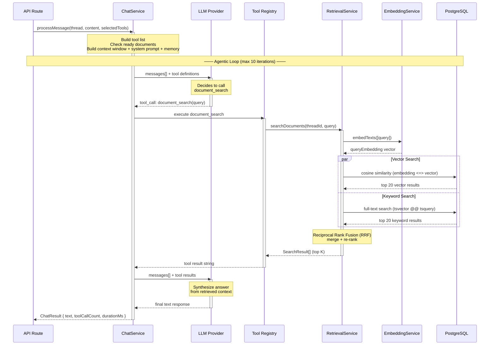

# Chat Service & Retrieval Service Flow Diagrams

## Message Processing with Document Search

```mermaid
sequenceDiagram
    participant API as API Route
    participant Chat as ChatService
    participant LLM as LLM Provider
    participant Tools as Tool Registry
    participant Retrieval as RetrievalService
    participant Embed as EmbeddingService
    participant DB as PostgreSQL

    API->>Chat: processMessage(thread, content, selectedTools)
    activate Chat

    Note over Chat: Build tool list<br/>Check ready documents<br/>Build context window + system prompt + memory

    Note over API,DB: ─── Agentic Loop (max 10 iterations) ───

    Chat->>LLM: messages[] + tool definitions
    activate LLM
    Note over LLM: Decides to call<br/>document_search
    LLM-->>Chat: tool_call: document_search(query)
    deactivate LLM

    Chat->>Tools: execute document_search
    activate Tools
    Tools->>Retrieval: searchDocuments(threadId, query)
    activate Retrieval

    Retrieval->>Embed: embedTexts([query])
    Embed-->>Retrieval: queryEmbedding vector

    par Vector Search
        Retrieval->>DB: cosine similarity (embedding <=> vector)
        DB-->>Retrieval: top 20 vector results
    and Keyword Search
        Retrieval->>DB: full-text search (tsvector @@ tsquery)
        DB-->>Retrieval: top 20 keyword results
    end

    Note over Retrieval: Reciprocal Rank Fusion (RRF)<br/>merge + re-rank

    Retrieval-->>Tools: SearchResult[] (top K)
    deactivate Retrieval
    Tools-->>Chat: tool result string
    deactivate Tools

    Chat->>LLM: messages[] + tool results
    activate LLM
    Note over LLM: Synthesize answer<br/>from retrieved context
    LLM-->>Chat: final text response
    deactivate LLM

    Chat-->>API: ChatResult { text, toolCallCount, durationMs }
    deactivate Chat
```
