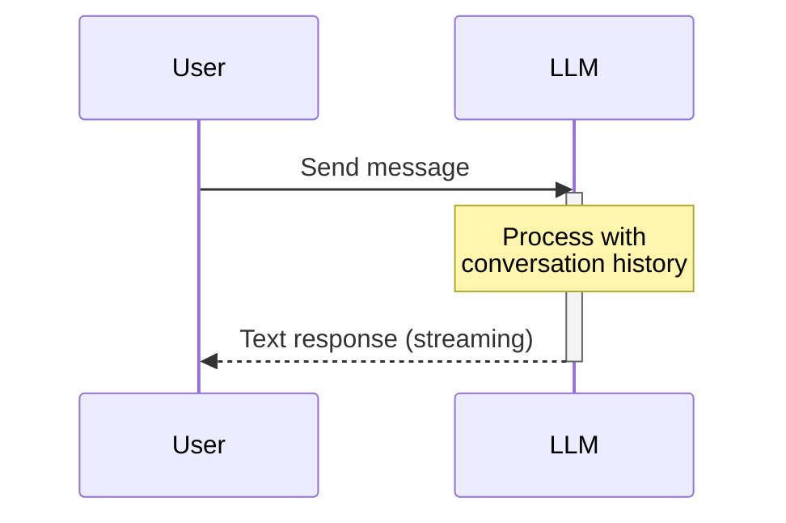
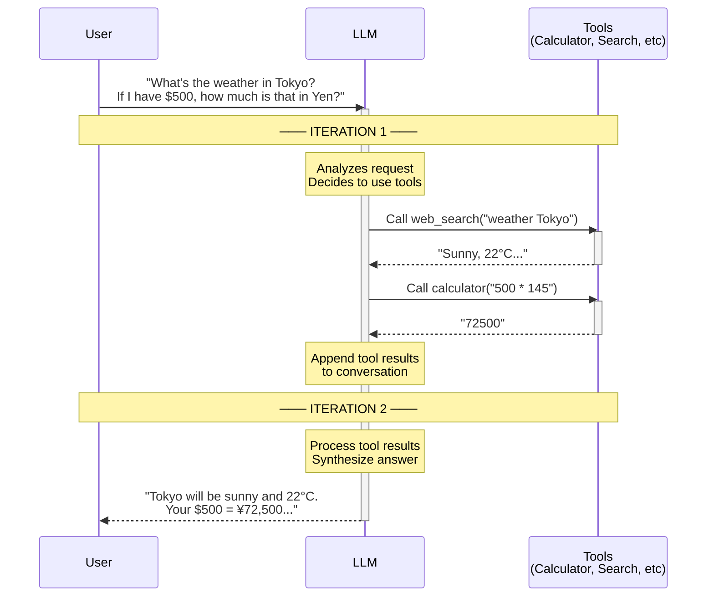

# Tool Calling Execution Flow Diagrams

## Simple Flow (WITHOUT Tool Calling)

```mermaid
sequenceDiagram
    participant User
    participant LLM
    
    User->>LLM: Send message
    activate LLM
    
    Note over LLM: Process with<br/>conversation history
    
    LLM-->>User: Text response (streaming)
    
    deactivate LLM
```

---

## Agentic Loop (WITH Tool Calling)

```mermaid
sequenceDiagram
    participant User
    participant LLM
    participant Tools as Tools<br/>(Calculator, Search, etc)
    
    User->>LLM: "What's the weather in Tokyo?<br/>If I have $500, how much is that in Yen?"
    activate LLM
    
    Note over User,Tools: ─── ITERATION 1 ───
    
    Note over LLM: Analyzes request<br/>Decides to use tools
    
    LLM->>Tools: Call web_search("weather Tokyo")
    activate Tools
    Tools-->>LLM: "Sunny, 22°C..."
    deactivate Tools
    
    LLM->>Tools: Call calculator("500 * 145")
    activate Tools
    Tools-->>LLM: "72500"
    deactivate Tools
    
    Note over LLM: Append tool results<br/>to conversation
    
    Note over User,Tools: ─── ITERATION 2 ───
    
    Note over LLM: Process tool results<br/>Synthesize answer
    
    LLM-->>User: "Tokyo will be sunny and 22°C.<br/>Your $500 = ¥72,500..."
    
    deactivate LLM
```
